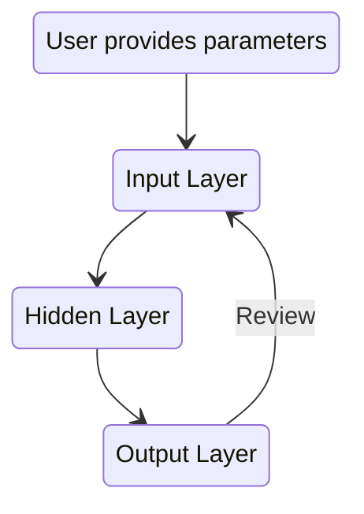

# :potato: :cheese: Cheddar Butler v3 Golden Potato Edition :potato: :cheese: 
<br>

Cheddar Butler v3 builds upon the first closed version that used the Ameritrade API,
as well as the second version Bacon Saver which used the yfinance module. It is 
simplified into three steps. The first takes the inputs as indicated by
the user. The second is a hidden layer which screens for the data requested. Finally
the result is generated into both a file and the terminal output. The flow looks somewhat like this:
<br>
<br>


  


***Check back for updates to this project***
<br>
<br>
<br>
Pending tasks:
<br>
Deadline: Jan 10, 2023
<br>

- [ ] Create iterable list of stock tickers to pass through functions. :test_tube:

*1/4/2023 - Ran into an exception while retrieving option chain data from yfinance, currently monitoring stack trace:*

```python 
   yfinance  "ValueError: Expiration `YYYY-MM-DD` cannot be found. Available expiration are: []"
```
<br>

*1/5/2023 - The input ticker symbol required for the yfinance module needs to be correct. So far the function is iterating through an object list and it is starting with the index of zero, whereas there was a breakthrough late last night when converting this input. If this the case then this new method needs to be grafted into the old code and the old code should be intensively debugged. Furthermore, the option data frame is now cleaned up in experimental mode and this also needs to be merged with the old code. The repository should be on time
to be updated by the deadline.*

- [ ] Create trade execution function.:computer:

- [ ] Generate additional sample outputs.:printer:

[](https://deploy.cloud.run)<br><br>
### Useful Resources
[yfinance](https://pypi.org/project/yfinance/)<br><br>
[Alpaca Trade API](https://github.com/alpacahq/alpaca-trade-api-python)<br><br>
[Ally API](https://www.ally.com/api/invest/documentation/getting-started/)<br><br>
[Mermaid](https://github.com/mermaid-js/mermaid)<br><br>
[Cheddar Butler](https://www.cheddarbutler.com)

<details><summary>Click for Disclaimer Information</summary>
<p>

#### Notes:

*This project is meant purely for educational purposes only. As with any mathematical model it can be dangerous to rely blindly on results without thorough scrutiny.* 
  
 *Code blocks in this project will be presented in the following format:*  
  
```python
   run Command
```

Good advice:

[](https://www.youtube.com/watch?v=7hx4gdlfamo)
  
  
  
</p>
</details>


