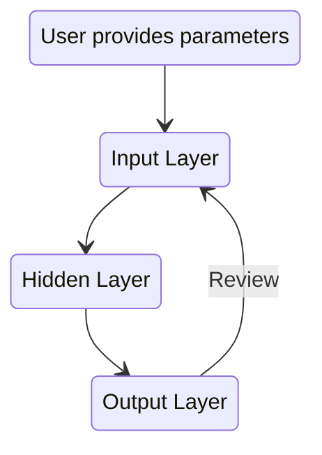

# Cheddar Butler v3 Golden Potato Edition

Cheddar Butler v3 builds upon the first closed version that used the Ameritrade API,
as well as the second version Bacon Saver which used the yfinance module. It is 
simplified into three steps. The first takes the inputs as indicated by
the user. The second is a hidden layer which screens for the data requested. Finally
the result is generated into both a file and the terminal output. 

  

***Check back for updates to this project***
 
Pending tasks:
 
Deadline: Jan 10, 2022
 
- [ ] Create iterable list of stock tickers to pass through functions
- [ ] Create trade execution function
- [ ] Generate additional sample outputs

### Useful Resources

[yfinance](https://pypi.org/project/yfinance/)  
[Alpaca Trade API](https://github.com/alpacahq/alpaca-trade-api-python)  
[Ally API](https://www.ally.com/api/invest/documentation/getting-started/)  
